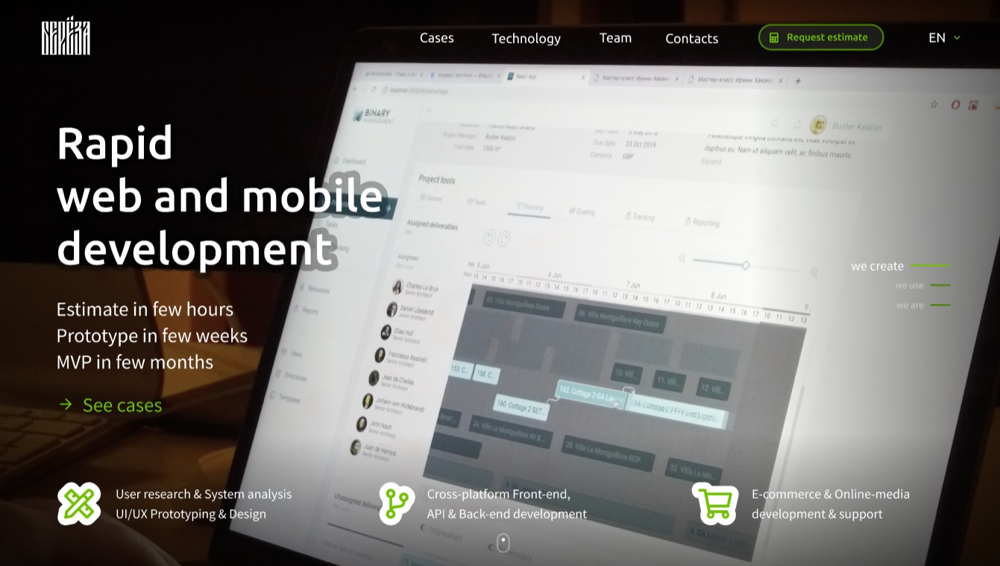

# Hakamada master class

Build for production (with metrics etc):
```
BUILD=prod npm run build
```

`master` branch deploy to dev stage  
`prod` branch deploy to prod stage

[Trello](https://trello.com/b/jsrvuqOC/%D0%BC%D0%BA-%D0%B2-%D1%82%D1%8E%D0%BC%D0%B5%D0%BD%D0%B8)  
[Figma](https://www.figma.com/file/vfb07U8T7QGYmzGlEEMrY4/hakamada?node-id=415%3A617)

